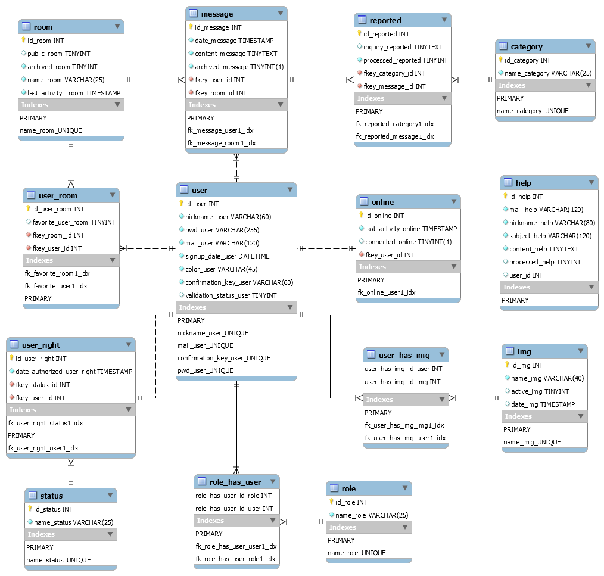

# Gabbler
> CF2m Team Gabbler.

Gabbler is a community chat project created by the students of the CF2M web developer class.

## Development address
Updated after each sprint (and FTP Update):

https://gabbler.webdev-cf2m.be/

## Test adress
Updated after echa sprint (and FTP Update):

https://testgabbler.webdev-cf2m.be/

## Instruction 

- copy and rename the file config.php.local to config.php

- Import data/db/db_gabbler2021-structure.sql *( port `3308`, use the same port - using MariaDB )*

## Description

__TO DO LIST__ :

[trello.com](https://trello.com/b/NhaVQegb/gabbler-2021)

__Graphic charter__ :

__Database__ :

## Global project charter

- Main language of the project : `ENGLISH`

- Language on Trello : `FRENCH` and `ENGLISH`

- Writing code in `OO language`

- Comment all the code

- Use Pascal case for PHP class (`MyFavoriteClass`) and the same name into model with .php (`MyFavoriteClass.php`)
  
- Use Camel case for PHP methods (`myFavoriteMethod()`) and variables (`$myVariable`). 

- Use pre-defined constant for the root  *( ex: `THE_ROOT` )*

- MVC structure :
    - `model` : file containing the mapping class and their Managers with `SQL` queries *( ex: `Room.php` and `RoomManager.php` )*
    - `controller` : file containing the transformation and security of data between the `Model` & `View` *( ex: `home.admin.controller.php` )*
    - `view` : file containing the HTML that displays the content - file provided in the `view` folder. We used Twig for Templates ( ex: `home_page.html.twig`)
  
- Other structure :
  - `config` : content configuration files
  - `test` : content test files
  - `data` : content prepare files
  - `public` : content public files (front controllers, css, images, front javascript etc ...)

- Pull request to `upstream`, no class or id for `CSS` must be in the view files

- Don't Work on `main` branch ! Make your first pull request on a buffer branch ( ex: `main2`, `test`).

- Link your branch to the ticket you are working on Trello ( one ticket = one branch, one branch = several commits )

- link `pull request` to `issues` in Trello

- All mapping table files extends
  
      MappingTableAbstract abstract class
  
- All Manager table files extends

      ManagerTableAbstract abstract class

- Often use gitmoji into commit and use an understandable message for each commit !

  https://gitmoji.dev/

